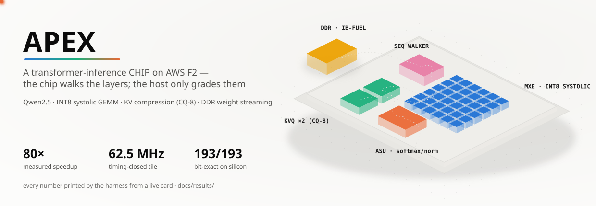
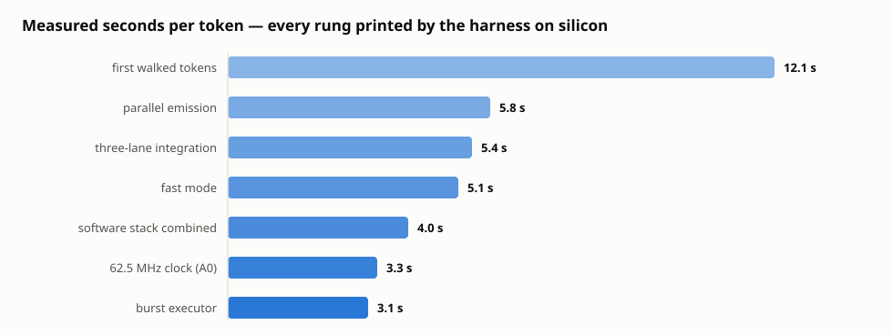
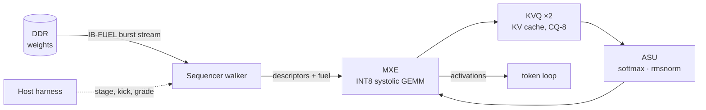

<picture>
  <source media="(prefers-color-scheme: dark)" srcset="assets/hero-dark.svg">
  
</picture>

<p align="center">
  
  
  
  
</p>

**APEX** is a transformer-inference NPU built and proven on AWS F2 FPGAs: an INT8
systolic GEMM tile (**MXE**), compressed KV caching (**KVQ**, CQ-8), a softmax/norm
unit (**ASU**), DDR weight streaming (**IB-FUEL**), and a **sequencer walker** that
executes entire transformer layers autonomously — the host stages a descriptor,
the chip walks the layer.

What makes this repo different is the discipline: **every value the silicon
produces is graded bit-exact against a golden model before any claim is made.**
Timing-closed builds, word-verified DDR images, a 193-check on-card battery, and
a token loop that refuses to sample a token from an unverified value. The full
evidence trail — flight records, verdict documents, per-rung measurements — ships
in `docs/results/`.

## Measured results

<picture>
  <source media="(prefers-color-scheme: dark)" srcset="assets/ladder-dark.svg">
  
</picture>

| | |
|---|---|
| End-to-end speedup, host-driven baseline → walked pipeline | **80× measured** (0.004 → 0.32 tok/s) |
| Tile clock, timing-closed and flown | **62.5 MHz** (WNS +0.015) |
| On-card acceptance battery | **193 checks, 0 fails**, bit-exact at speed |
| Walked-on-silicon step set (measured loop) | FPROJ · QKV · OPROJ · RES1 |
| Proven-on-silicon as chains | attention (score/PV), FFN→DOWN |

Every number above was printed by the harness from a live card. Reproduce it
with two commands (see Quickstart) for about $2 of EC2 time.

## Architecture



The walker owns the layer: weight fetch, GEMM sequencing, requantization,
KV commits, and the attention window all run without host intervention inside
a walk. The host's job is staging, kicking, and **grading**.

## Quickstart

Requirements: an AWS account with F2 access (`f2.6xlarge`), the AWS CLI, and an
SSH key. Registered FPGA images (AGFIs) are listed in
`scripts/fpga/f2/clock_key.py`.

```bash
# 1. Prove the silicon: boots a card, loads the image, runs the 193-check
#    battery + walked chains, prints the verdict, terminates itself (~30 min)
bash scripts/fpga/f2/run_walked_demo.sh

# 2. Talk to it: an interactive prompt CLI running the walked pipeline
bash scripts/fpga/f2/run_chat_demo.sh

# 3. Measure it: the token loop with per-phase timing
python3 scripts/fpga/f2/token_loop.py run --engine hw-walked --fast 3 \
    --tokens 6 --ddr-attested
```

For simulation-only development (no AWS needed), the Verilator twin runs the
same programs: `verif/f2sim/`, and `token_loop.py run --engine sim-walked`.

## Verification discipline

The project's rule: **sim-green is a hypothesis; silicon-green is a fact; and
every fact must be bit-exact.**

- **Golden model** (`golden/`): fixed-point-exact reference for every op —
  GEMM, requant, softmax, rmsnorm, rope, KV compression
- **Twin** (`verif/f2sim/`): a Verilator build of the full CL; every walk
  program runs here first
- **Mutation gates**: the test batteries prove they can catch injected defects
  (walker suite, tile suite, wcomp suite — signature mutants must all be caught)
- **On-card grading**: the token loop refuses to sample any token whose
  layer values did not grade bit-exact against golden
- **Flight records**: every card session's programs, captures, and verdicts
  are banked in `docs/results/`

Three silicon-vs-simulation divergences were found, root-caused to the netlist
level, and fixed during development — the war stories are preserved in
`docs/results/prompt_on_chip/` and are, frankly, half the value of the repo.

## Status — honest ledger

**Working and measured on silicon:** the walked layer front (FPROJ/QKV/OPROJ/RES1)
inside the token loop at 62.5 MHz; attention and FFN→DOWN proven bit-exact as
standalone walked chains; W4 (4-bit weight) datapath in RTL with sim gates.

**Open items:** one known walked-attention sequencing defect at live context
depth (fully characterized in `docs/results/prompt_on_chip/E7_LIVE_T_DEFECT.md` —
the exact silicon transfer map is documented and the netlist has been exonerated);
attention/FFN integration into the measured loop; the next clock/transport
optimization rungs. The measured ladder and remaining anatomy are in
`docs/results/prompt_on_chip/FIRST_WALKED_TOKENS.md`.

## Repository map

| Path | Contents |
|---|---|
| `rtl/` | The NPU: tile, MXE, KVQ, ASU, walker, glue |
| `golden/` | The bit-exact golden model |
| `verif/` | Verilator twin, test batteries, mutation gates |
| `scripts/fpga/f2/` | Build, flight, measurement, and demo tooling |
| `docs/design/` | Design documents and decision records |
| `docs/results/` | Flight records and verdicts — the evidence trail |

## License

Apache-2.0 — see [LICENSE](LICENSE).
