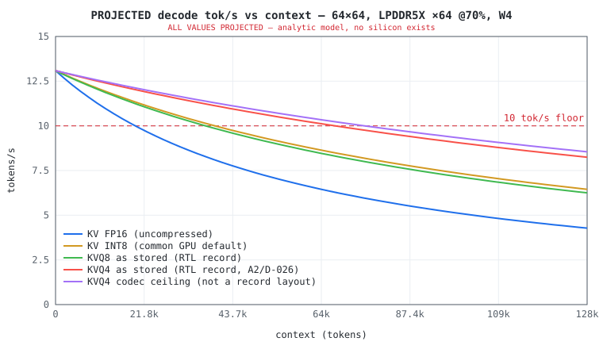
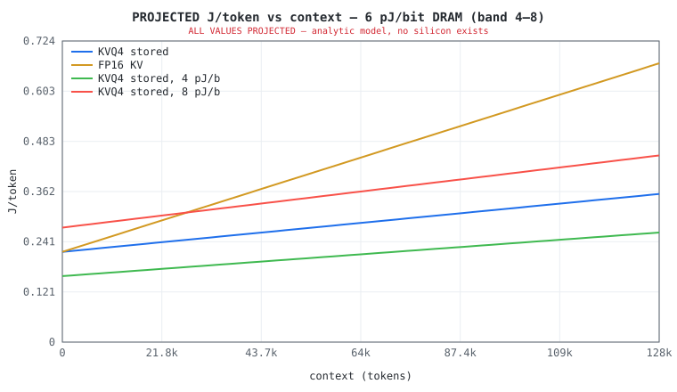
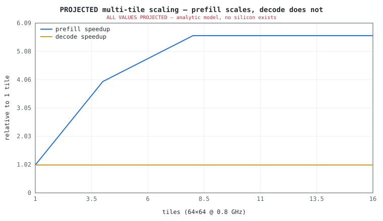

# APEX-7B performance model — ALL NUMBERS PROJECTED

> **THIS ENTIRE DOCUMENT IS A PROJECTION.** No APEX silicon exists; no board runs a 7B model today. This file is machine-generated by `perf/apex_perf_model.py` from (a) measured simulation / place-and-route calibration anchors, each cited to its in-repo artifact, and (b) explicitly listed assumptions. Regenerate with `python3 perf/apex_perf_model.py`. Nothing here is a benchmark of real hardware except the third-party comparator rows, which are cited to their sources.

Verified-today baseline for contrast: the 8×8 attention tile is bit-exact in simulation and the KVQ engine is placed-and-routed on an ECP5-85F — 34.11 MHz at the shipping config after the divider pipelining (`docs/results/s10_fmax/RESULT.md`; this model's 9.04 MHz anchor is the retained pre-pipelining calibration measurement, documented in `docs/results/s10_fmax/BASELINE.md`). Everything beyond that — bigger arrays, LPDDR, W4 weights, GQA, the hardware layer-walker — is unbuilt and assumed below.

## 1. Measured calibration anchors (the only measurements here)

| anchor | value | source |
|---|---|---|
| MMIO round-trips per host-sequenced attention step | ~300 (tile idle ~90%) | docs/OPTIMIZATION.md (measured, L3 choreography) |
| ASU divider emission | 33 cyc/element → 540,672 cyc @ T=128 | docs/OPTIMIZATION.md A1 |
| MXE, all six GEMMs of a T=128 step | ~65,000 cyc | docs/OPTIMIZATION.md (divider runs ~8× longer) |
| Measured MXE utilization | 30.6% (= the measured 3.3×-off-ideal gap) | docs/OPTIMIZATION.md B4 |
| KVQ engine ECP5-85F Fmax | 9.04 MHz (historical un-pipelined-divider measurement, retained as the calibration anchor; ship config now routes at 34.11 MHz) | docs/results/s10_fmax/BASELINE.md (pre-S10 baseline) |
| Tile weight port | 8 B/cycle (8-lane INT8 beat) | rtl/apex_pkg.sv MXE_N=8 |
| KVQ4 D=128 stored record | 4.5625 b/v = 3.51× | golden/tests/test_effective_bits.py (pinned, runs in CI) |
| KVQ4 D=128 codec ceiling | 4.125 b/v = 3.88× | same gate |

Validation — the model reproduces the derivable anchors (`--check` asserts these):

| check | model | anchor |
|---|---|---|
| today-tile weight-port-bound decode @ 9.04 MHz | 0.010 tok/s | ~0.01 tok/s |
| today-tile weight-port-bound decode @ 100 MHz | 0.113 tok/s | ~0.113 tok/s |
| today-tile weight-port-bound decode @ 400 MHz | 0.453 tok/s | ~0.452 tok/s |
| divider/MXE cycle ratio @ T=128 | 8.3× | ~8× |

## 2. Assumptions (everything that is NOT measured)

Workload: **Qwen2.5-7B** — 28 layers, hidden 3584, 28 heads / 4 KV heads (GQA), head_dim 128, FFN 18944, vocab 152,064.

* Derived weight MACs/token: **7.07 G** (per-layer 233.0 M × 28 + LM head 545 M). Attention adds 2·heads·head_dim·ctx·layers ≈ 6.58 G at 32k ctx.
* KV cache: **28,672 values/token** (GQA), i.e. 56 KiB/token at FP16, 16.0 KiB/token as KVQ4 stored records.
* **UNBUILT features assumed by the projections** (each is a task on the backlog): GQA plumbing (S6), B1 hardware layer-walker (≤3 MMIO/layer-step; without it decode is transaction-bound), B3 native-W4 weight path (4.125 b/w incl. scales at the G=128 amortization; the B3 stage-6 adoption geometry is G=32 = 4.5 b/w — sensitivity in §3b½), A1 radix-4 divider + B4 ingest-under-compute (the 65% utilization scenario), wide-D RMSNorm for hidden=3584, T>128 chunk merge.
* Memory: peak GB/s = MT/s × bus bytes; sustained efficiency swept (0.65, 0.7, 0.75) (default 70%) — single-stream mixed read traffic on LPDDR does not reach peak.
* Host: MMIO round-trip 1.5 µs; host-sequenced mode 5 MMIO/job (calibrated: ~300 measured MMIO per ~60-job attention step); walker mode 3 MMIO/layer-step.
* Energy: DRAM (4.0, 6.0, 8.0) pJ/bit swept (default 6.0), see citation [dram-energy]; INT8 MAC 0.35 pJ × 1.5× on-chip movement overhead; static floor 0.5 W. DRAM energy dominates (60–75% of total) — it is both the biggest lever and the biggest uncertainty in every energy number below.
* Prefill: T=128 chunks; weights re-streamed once per chunk (no on-die weight residency); utilization scenarios: measured-today (30.6%) = 31%; post-A1/B4 target (65%) = 65%; ideal (90%) = 90%. Default scenario: **post-A1/B4 target (65%)**.
* KV traffic uses the **stored-record accounting** (what the RTL writes, tag+pad+scale-bank included) per the honest-accounting gate; the codec ceiling is plotted as a separate labeled curve, never as the headline.

## 3. PROJECTED decode throughput

Reference configuration (the S13 candidate): **64×64 INT8 @ 0.5–0.8 GHz, LPDDR5X x64 (68.3 GB/s), eff 70%, W4 weights, KVQ4 stored records, walker**. Decode is memory-bound: the array and clock barely matter; the memory system and bytes/token decide everything.

### 3a. tok/s vs memory system and weight precision (ctx = 2k)

| memory system | eff | W4 + KVQ4 | W4 + FP16 KV | INT8 + KVQ4 | INT8 + FP16 KV |
|---|---|---|---|---|---|
| LPDDR5X x32 (34.1 GB/s) | 70% | **6.5** | 6.3 | 3.4 | 3.3 |
| LPDDR5X x64 (68.3 GB/s) | 70% | **13.0** | 12.7 | 6.7 | 6.6 |
| LPDDR5X x128 (136.5 GB/s) | 70% | **25.9** | 25.3 | 13.4 | 13.3 |

* A single ×32 LPDDR5X channel projects to **6.5 tok/s** — below the 10 tok/s floor. The spec must say ×64.
* INT8 weights + ×64 projects to 6.7 tok/s — also below floor. **W4 (B3) is load-bearing for the decode floor, and it is unbuilt.**

### 3b. tok/s vs context — the KVQ flat-region claim

| context | KV FP16 (uncompressed) | KV INT8 (common GPU default) | KVQ8 as stored (RTL record) | KVQ4 as stored (RTL record, A2/D-026) | KVQ4 codec ceiling (not a record layout) |
|---|---|---|---|---|---|
| 0 | 13.1 | 13.1 | 13.1 | 13.1 | 13.1 |
| 1,024 | 12.9 | 13.0 | 13.0 | 13.0 | 13.0 |
| 2,048 | 12.7 | 12.9 | 12.9 | 13.0 | 13.0 |
| 4,096 | 12.3 | 12.7 | 12.7 | 12.9 | 12.9 |
| 8,192 | 11.6 | 12.3 | 12.2 | 12.6 | 12.7 |
| 16,384 | 10.4 | 11.6 | 11.5 | 12.2 | 12.3 |
| 21,000 | 9.8 | 11.2 | 11.1 | 12.0 | 12.1 |
| 32,768 | 8.6 | 10.4 | 10.3 | 11.4 | 11.6 |
| 49,152 | 7.4 | 9.4 | 9.3 | 10.7 | 10.9 |
| 65,536 | 6.4 | 8.6 | 8.5 | 10.1 | 10.3 |
| 78,000 | 5.9 | 8.1 | 7.9 | 9.7 | 9.9 |
| 98,304 | 5.1 | 7.4 | 7.2 | 9.1 | 9.4 |
| 131,072 | 4.3 | 6.4 | 6.3 | 8.2 | 8.5 |

**≥10 tok/s flat region** (largest context holding the floor, reference config):

| KV mode | flat region extends to | vs FP16 |
|---|---|---|
| KV FP16 (uncompressed) | ~19k ctx | 1.00× |
| KV INT8 (common GPU default) | ~38k ctx | 2.00× |
| KVQ8 as stored (RTL record) | ~36k ctx | 1.88× |
| KVQ4 as stored (RTL record, A2/D-026) | ~67k ctx | 3.51× |
| KVQ4 codec ceiling (not a record layout) | ~74k ctx | 3.88× |

KVQ stretches the ≥10 tok/s region from **~19k to ~67k context** as stored today (~74k at the codec ceiling). At 128k ctx: 8.2 vs 4.3 tok/s — KVQ keeps long-context decode ~2× faster, PROJECTED.

KV-read traffic crosses weight traffic at **~62k ctx uncompressed** vs **~218k compressed (stored)** — with KVQ4 the KV stream never dominates inside a 128k window.

### 3b½. W4 grouping sensitivity — the B3 stage-6 adoption geometry

The B3 stage-6 token-quality gate (`docs/results/b3_w4_adoption/RESULTS.md`, 2026-07-21) rejected tile-wide W4 scales (collapses the 7B model) and measured **G=32 K-grouping** as the quality-viable config — fp16 scale per 32 weights = **4.5 b/w** vs the 4.125 b/w (G=128 amortization) used elsewhere in this document. Decode is weight-BW-bound, so the shipped-W4 numbers shift down ~9%:

| ctx | W4 4.125 b/w (G=128) | W4-G32 4.5 b/w (adoption) |
|---|---|---|
| 2,048 | 13.0 | 11.9 |
| 32,768 | 11.4 | 10.6 |
| 65,536 | 10.1 | 9.5 |
| 131,072 | 8.2 | 7.8 |

The ≥10 tok/s flat region contracts from ~67k to **~48k context** at the adoption geometry (reference config, KVQ4 stored records). The decode floor still clears at 32k (10.6 tok/s). Quote W4-dependent decode numbers from THIS section once B3 ships at G=32.

### 3c. Host sequencing: why the walker (B1) is mandatory

* Today's contract (GEMV M=1, K≤2048, N≤8) needs **486,016 tile jobs per decode token** at 7B. Host-sequenced at 5 MMIO/job × 1.5 µs that is 3.6 s/token of pure transaction time → **0.27 tok/s** no matter how fast the memory is.
* With the B1 walker (≤3 MMIO/layer-step): host overhead 126 µs/token (~0.2% of the token) → 13.0 tok/s.

## 4. PROJECTED prefill / TTFT

TTFT for a 1,024-token prompt (W4 weights, LPDDR5X x64 (68.3 GB/s), eff 70%). Prefill is compute-bound: the array and its utilization decide TTFT; memory decides decode.

| array | clock | measured-today (30.6%) | post-A1/B4 target (65%) | ideal (90%) |
|---|---|---|---|---|
| 8×8 | 0.5 GHz | 750.1 s | 353.1 s | 255.0 s |
| 8×8 | 1.0 GHz | 375.1 s | 176.6 s | 127.5 s |
| 16×16 | 0.5 GHz | 187.5 s | 88.3 s | 63.8 s |
| 16×16 | 1.0 GHz | 93.8 s | 44.1 s | 31.9 s |
| 32×32 | 0.2 GHz | 117.2 s | 55.2 s | 39.9 s |
| 32×32 | 0.5 GHz | 46.9 s | 22.1 s | 15.9 s |
| 32×32 | 0.8 GHz | 29.3 s | 13.8 s | 10.0 s |
| 32×32 | 1.0 GHz | 23.4 s | 11.0 s | 8.0 s |
| 32×32 | 1.2 GHz | 19.5 s | 9.2 s | 6.6 s |
| 64×64 | 0.2 GHz | 29.3 s | 13.8 s | 10.0 s |
| 64×64 | 0.5 GHz | 11.7 s | 5.5 s | 4.0 s ←spec |
| 64×64 | 0.8 GHz | 7.3 s | 3.4 s | 2.5 s ←spec |
| 64×64 | 1.0 GHz | 5.9 s | 2.8 s | 2.0 s |
| 64×64 | 1.2 GHz | 4.9 s | 2.3 s | 1.7 s |
| 128×128 | 0.2 GHz | 7.3 s | 3.4 s | 2.5 s |
| 128×128 | 0.5 GHz | 2.9 s | 1.4 s | 1.0 s |
| 128×128 | 0.8 GHz | 1.8 s | 0.9 s | 0.6 s |
| 128×128 | 1.0 GHz | 1.5 s | 0.7 s | 0.6 s |
| 128×128 | 1.2 GHz | 1.2 s | 0.6 s | 0.6 s |

Reference config TTFT(1k): **3.4–5.5 s** at 0.8/0.5 GHz under the post-A1/B4 target (65%) scenario. At today's *measured* 30.6% utilization the same array would need 7.3 s — A1 (radix-4 divider) and B4 (ingest-under-compute) are load-bearing for the TTFT floor.

A 32×32 @ 1 GHz array projects to 11.0 s TTFT at target utilization — marginal against a 5 s floor; the 64×64 array is sized by prefill, not decode.

## 5. PROJECTED energy per token vs context (KVQ on/off)

Reference config; DRAM at 6.0 pJ/bit (band = 4–8 pJ/bit). J/token = DRAM traffic + MAC energy + 0.5 W static × token time.

| context | J/tok KVQ4 (4/6/8 pJ/b) | J/tok FP16 KV (6 pJ/b) | power @ KVQ4 6 pJ/b | tok/s KVQ4 |
|---|---|---|---|---|
| 0 | 0.16 / 0.22 / 0.28 | 0.22 | 2.8 W | 13.1 |
| 1,024 | 0.16 / 0.22 / 0.28 | 0.22 | 2.8 W | 13.0 |
| 2,048 | 0.16 / 0.22 / 0.28 | 0.22 | 2.8 W | 13.0 |
| 4,096 | 0.16 / 0.22 / 0.28 | 0.23 | 2.8 W | 12.9 |
| 8,192 | 0.17 / 0.23 / 0.29 | 0.25 | 2.8 W | 12.6 |
| 16,384 | 0.17 / 0.23 / 0.30 | 0.27 | 2.9 W | 12.2 |
| 21,000 | 0.18 / 0.24 / 0.30 | 0.29 | 2.9 W | 12.0 |
| 32,768 | 0.18 / 0.25 / 0.32 | 0.33 | 2.9 W | 11.4 |
| 49,152 | 0.20 / 0.27 / 0.34 | 0.39 | 2.9 W | 10.7 |
| 65,536 | 0.21 / 0.29 / 0.36 | 0.44 | 2.9 W | 10.1 |
| 78,000 | 0.22 / 0.30 / 0.38 | 0.49 | 2.9 W | 9.7 |
| 98,304 | 0.24 / 0.32 / 0.41 | 0.56 | 2.9 W | 9.1 |
| 131,072 | 0.26 / 0.36 / 0.45 | 0.67 | 2.9 W | 8.2 |

Short-context headline, PROJECTED: **~0.16–0.28 J/token at ~2.1–3.6 W** (die+DRAM; excludes host SoC). The DRAM pJ/bit assumption alone moves this ±35%.

## 6. Comparator table — published single-stream 7B/8B Q4 decode

Rules of this table: single-stream, single-user decode only; wall/board/module power as cited; quantization as cited. Batched GPU serving amortizes to far lower J/token (0.05–0.4) and is a different job — do not compare this table against batched or speculative-decoding numbers. The APEX row is a PROJECTION from this model; every other row is a third-party measurement or vendor claim, cited.

| device | tok/s | power | J/token | basis |
|---|---|---|---|---|
| RTX 4090 (llama.cpp CUDA, 7B/8B Q4) | ~100–180 | ~250–320 W sustained | **~1.4–3.2** | measured [puget][spheron4090][hw-survey] |
| RTX 3090 (llama.cpp, 7B/8B Q4) | ~100–130 | ~275–350 W | **~2.1–3.5** | measured [puget][vulkan-bench] |
| RX 7900 XTX (llama.cpp, 7B/8B Q4) | ~95–130 | ~300–355 W | **~2.3–3.7** | measured [vulkan-bench] |
| A100 / H100 (batch-1, 7B) | ~120–145 | ~150–300 W | **~1.0–2.5** | measured [koyeb][baseten] |
| Jetson Orin Nano Super (Llama-3.1-8B INT4) | 14.2 @ 15 W mode / 19.1 @ 25 W mode | 15 / 25 W (mode budget) | **~1.0–1.3** | measured [jetson][jetson-lab] |
| Apple M4 Max (llama.cpp Metal, 7B Q4_0) | 83.1 | ~24–25 W package (community powermetrics) | **~0.30** | measured [m4max] |
| Hailo-10H M.2 (Llama2-7B) | ~10 | <5 W module | **~0.45–0.5** | vendor claim [hailo][hailo-eet] |
| **APEX-7B (this model)** | 12–14 | ~2.1–3.6 W (die+DRAM, modeled) | **~0.16–0.28** | **PROJECTED — no hardware** |

What the table does and does not support, stated plainly:
* Desktop discrete GPUs are ~8–14× *faster* than the APEX projection at batch-1. The projected win is **energy per token** (~5–10× vs stock desktop GPUs), never speed.
* Hailo-10H and Apple M4 Max already sit at 0.3–0.5 J/token — APEX does **not** claim first or only sub-0.5 J/token. The differentiating cell is J/token **held flat to long context** via in-datapath KV compression (§3b/§5), which none of the cited edge devices document.
* A power-capped 4090 or a TensorRT-LLM/speculative stack compresses the gap to ~2–6×.

Citations:

* `[puget]` Puget Systems, "LLM Inference — Consumer GPU performance" (llama.cpp, single stream) — <https://www.pugetsystems.com/labs/articles/llm-inference-consumer-gpu-performance/> (accessed 2026-07-14)
* `[spheron4090]` Spheron, "RTX 4090 for AI/ML" (250–320 W sustained during LLM inference) — <https://www.spheron.network/blog/rtx-4090-for-ai-ml/> (accessed 2026-07-14)
* `[hw-survey]` Li et al., "LLM Inference Acceleration: A Comprehensive Hardware Perspective" (arXiv:2410.04466; cross-platform tok/s and tok/J incl. RTX 4090 Llama-2-7B INT4) — <https://arxiv.org/html/2410.04466v3> (accessed 2026-07-14)
* `[vulkan-bench]` llama.cpp discussion #10879, "Performance of llama.cpp with Vulkan" (community multi-GPU 7B/8B Q4 table: RTX 3090, RX 7900 XTX, RTX 4090) — <https://github.com/ggml-org/llama.cpp/discussions/10879> (accessed 2026-07-14)
* `[koyeb]` Koyeb, "GPU LLM Performance Benchmarks" (A100/H100 single-request latency & throughput) — <https://www.koyeb.com/docs/hardware/gpu-benchmarks> (accessed 2026-07-14)
* `[baseten]` Baseten, "Unlocking the full power of NVIDIA H100 GPUs for ML inference with TensorRT" (Mistral-7B batch-1) — <https://www.baseten.co/blog/unlocking-the-full-power-of-nvidia-h100-gpus-for-ml-inference-with-tensorrt/> (accessed 2026-07-14)
* `[jetson]` NVIDIA Developer Blog, "Jetson Orin Nano Developer Kit Gets a Super Boost" (Llama-3.1-8B INT4/MLC: 14.19 tok/s original 15 W mode → 19.14 tok/s Super 25 W mode) — <https://developer.nvidia.com/blog/nvidia-jetson-orin-nano-developer-kit-gets-a-super-boost/> (accessed 2026-07-14)
* `[jetson-lab]` NVIDIA Jetson AI Lab benchmarks page (measured tok/s tables incl. power modes) — <https://www.jetson-ai-lab.com/archive/benchmarks.html> (accessed 2026-07-14)
* `[m4max]` llama.cpp discussion #4167, "Performance of llama.cpp on Apple Silicon M-series" (M4 Max 7B Q4_0 TG = 83.06 tok/s; package power ~24–25 W is community powermetrics reporting, not an official spec) — <https://github.com/ggml-org/llama.cpp/discussions/4167> (accessed 2026-07-14)
* `[hailo]` Hailo, "Hailo-10H M.2 Generative AI Acceleration Module" (vendor: Llama2-7B up to ~10 tok/s at <5 W module power) — <https://hailo.ai/products/ai-accelerators/hailo-10h-m-2-ai-acceleration-module/> (accessed 2026-07-14)
* `[hailo-eet]` EE Times, "LLMs in 2.5 Watts: Hailo Targets Lower Power Market" — <https://www.eetimes.com/llms-in-2-5-watts-hailo-targets-lower-power-market/> (accessed 2026-07-14)
* `[dram-energy]` Published DRAM system-energy anchors: DDR5 ~14–16 pJ/bit, GDDR7 ~9–11 pJ/bit, HBM2 ~3.9 pJ/bit (e.g. PatSnap Eureka HBM4 energy metrics survey); LPDDR5X modeled at 4–8 pJ/bit between the HBM and DDR5 anchors — <https://eureka.patsnap.com/report-hbm4-energy-metrics-bandwidth-per-watt-and-pj-bit-benchmarks> (accessed 2026-07-14)

## 7. PROJECTED multi-tile scaling

Tiles share one memory system (multi-tile NoC is explicitly out of current scope; this is the paper exercise). Decode is bandwidth-bound, so extra tiles buy ~nothing; prefill is compute-bound and scales until the weight stream saturates the memory. That asymmetry is the honest multi-tile story.

| tiles (64×64 @ 0.8 GHz each) | TTFT(1k) | prefill tok/s | prefill bound by | decode tok/s (2k ctx) |
|---|---|---|---|---|
| 1 | 3.45 s | 297 | compute | 13.0 |
| 2 | 1.73 s | 594 | compute | 13.0 |
| 4 | 0.86 s | 1,186 | compute | 13.0 |
| 8 | 0.61 s | 1,675 | **memory (BW ceiling)** | 13.0 |
| 16 | 0.61 s | 1,675 | **memory (BW ceiling)** | 13.0 |

## 8. Spec floors check (S13: decode ≥10 tok/s to ≥32k ctx, TTFT(1k) ≤5 s, ≤5 W)

| config | decode @32k | TTFT(1k) | power @32k | verdict |
|---|---|---|---|---|
| 64×64 @ 0.8 GHz, LPDDR5X x64 (68.3 GB/s) | 11.4 tok/s | 3.4 s | 2.9 W | **PASS** |
| 64×64 @ 0.5 GHz, LPDDR5X x64 (68.3 GB/s) | 11.4 tok/s | 5.5 s | 2.9 W | FAIL |
| 32×32 @ 1.0 GHz, LPDDR5X x64 (68.3 GB/s) | 11.4 tok/s | 11.0 s | 2.9 W | FAIL |
| 64×64 @ 0.8 GHz, LPDDR5X x32 (34.1 GB/s) | 5.7 tok/s | 3.4 s | 1.7 W | FAIL |

Utilization is the swing variable at the low-clock end: 64×64 @ 0.5 GHz misses the 5 s TTFT floor at 65% utilization but passes at 90% (4.0 s). Under this model's assumptions the robust spec point is **64×64 @ ≥0.65 GHz with LPDDR5X ×64** — a single ×32 channel fails decode outright, and a 32×32 array fails TTFT at any plausible clock.

## 9. Known limitations of this model

* No DRAM controller, refresh, bank-conflict, or page-policy modeling — a flat efficiency factor stands in for all of it.
* Activation traffic between layers is assumed on-die; logits readout and sampling are ignored (<1% of traffic).
* The 65% utilization scenario assumes A1+B4 land as designed; the only *measured* utilization is 30.6%.
* The ASU divider is not modeled separately at ASIC scale. As measured it emits 33 cyc/element on one lane, which would bind prefill even at 64×64; the 65% scenario assumes the A1 radix-4 divider plus widened emission hide it under the MXE. That is a design assumption, not a measurement.
* Energy has no per-block breakdown from synthesis — pJ/MAC and pJ/bit are literature anchors, not extracted from our netlist.
* Comparator rows were not re-measured by us; a wall-metered single-stream 4090 baseline with a committed re-run script is an open follow-up.

---
*Generated by `perf/apex_perf_model.py` — regenerate, never hand-edit. ALL NUMBERS PROJECTED.*
