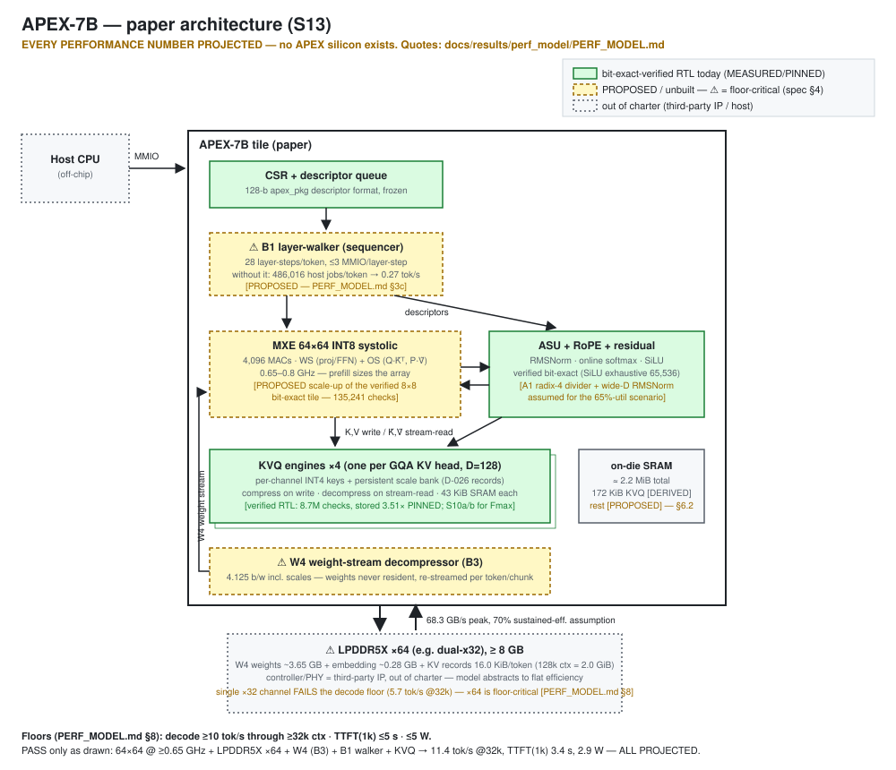

# APEX-7B — Paper Architecture Specification (S13)

> ⚠️ **THIS IS A PAPER ARCHITECTURE. EVERY PERFORMANCE NUMBER IN THIS DOCUMENT IS A
> PROJECTION, NOT A MEASUREMENT.** No APEX silicon exists; no board runs a 7B model
> today. All projected numbers are quoted verbatim from
> `docs/results/perf_model/PERF_MODEL.md` (machine-generated by
> `perf/apex_perf_model.py`; its calibration anchors are asserted by
> `python3 perf/apex_perf_model.py --check` — re-run before quoting; last verified
> PASS 2026-07-14, "ALL ANCHORS REPRODUCED"). Storage-geometry numbers are pinned
> and CI-asserted by `golden/tests/test_effective_bits.py` (last verified PASS
> 2026-07-14, "ALL PINNED ACCOUNTINGS MATCH").
>
> Status: draft, 2026-07-14 (task S13). Companion docs: `ARCHITECTURE.md` (the
> verified tile), `docs/results/perf_model/PERF_MODEL.md` (the model behind every
> projection here), `docs/OPTIMIZATION.md` (the backlog items this spec depends on).
>
> **This file is part of the S13 `docs/spec/` package:**
> `APEX7B_SPEC.md` (this document) ·
> [`apex7b_block_diagram.svg`](apex7b_block_diagram.svg) (block diagram,
> verified-vs-proposed color-coded) ·
> [`FLOOR_TRACEABILITY.md`](FLOOR_TRACEABILITY.md) (every floor-bearing line of
> this spec mapped to its `PERF_MODEL.md` anchor — read it before editing any
> number here).

## 0. Provenance labels

Every number in this document carries one of five tags:

| tag | meaning |
|---|---|
| **[PINNED]** | CI-asserted constant (record geometry, stored ratios) — `test_effective_bits.py` or a frozen RTL localparam |
| **[MEASURED]** | simulation / place-and-route measurement of the existing tile, cited to its artifact |
| **[PROJECTED]** | output of the calibrated analytic model — quote only from `PERF_MODEL.md` |
| **[DERIVED]** | arithmetic on PINNED/PROJECTED inputs, shown inline |
| **[PROPOSED]** | a design choice of this spec, not yet built or modeled |

Anything not labeled MEASURED or PINNED does not exist in hardware.

## 1. What APEX-7B is

APEX-7B is the single-chip operating point of the APEX architecture: an edge NPU for
**local, single-user inference of 7B-class LLMs**, staking one claim — **energy per
token held flat to long context**, delivered by in-datapath KV-cache compression
(KVQ) that is already bit-exact-verified RTL today.

Approved external wording (claim discipline: `docs/launch/CAMPAIGN.md` §3): *"verified decoder-layer and
KV-compression RTL of an architecture sized for 7B-class models (head_dim=128
verified), demonstrated on a real 7B model, with a calibrated projected performance
model."* This spec never claims "runs a 7B model" of any built artifact.

**What exists today (the calibration base for everything below):**

- Bit-exact attention tile and decoder-layer blocks vs an executable golden arbiter:
  8,748,634 KVQ arithmetic checks / 0 fails; 135,241 attention-tile checks;
  exhaustive SiLU 65,536/65,536; RoPE 12,288/12,288 at head_dim 64 and 128
  [MEASURED — `STATUS.md`, machine-generated].
- KV records with the D-026 deduplicated layout, stored whole-KV **3.16× (D=64) /
  3.51× (D=128)** at shipped k≤2, every overhead counted [PINNED].
- A placed-and-routed ECP5-85F KVQ bitstream at reduced capacity. Honest FPGA
  status 2026-07-14: the proxy config routes at 9.19 MHz; the ship-capacity config
  does not currently place (BRAM inference blocked, fix = S10a; see
  `docs/results/s10_fmax/BASELINE.md`) [MEASURED].
- Golden-model 7B plumbing: GQA (H_kv), Qwen QKV biases, wide-D RMSNorm (D=3584),
  T>128 online-softmax chunk merge — golden only, RTL backlog [MEASURED, S6].
- A calibrated analytic performance model whose anchors (MMIO count, divider
  cycles, MXE utilization, P&R Fmax, stored-record bits) are measured and asserted
  on every `--check` run [MEASURED anchors → PROJECTED outputs].

Everything else in this document — the 64×64 array, LPDDR5X, W4 weights, the
hardware walker, the clock target — is **unbuilt**.

## 2. Binding requirement floors

The spec is sized by three user-set floors ("doesn't-deeply-suck" thresholds,
2026-07-13), checked mechanically in `PERF_MODEL.md` §8:

| # | floor | value |
|---|---|---|
| F1 | decode throughput | **≥ 10 tok/s sustained through ≥ 32k context** |
| F2 | time-to-first-token, 1,024-token prompt | **≤ 5 s** |
| F3 | total power (die + DRAM) | **≤ 5 W** |

Floors-check verdicts [PROJECTED, PERF_MODEL.md §8]:

| config | decode @32k | TTFT(1k) | power @32k | verdict |
|---|---|---|---|---|
| **64×64 @ 0.8 GHz, LPDDR5X ×64 (68.3 GB/s)** | **11.4 tok/s** | **3.4 s** | **2.9 W** | **PASS** |
| 64×64 @ 0.5 GHz, LPDDR5X ×64 | 11.4 tok/s | 5.5 s | 2.9 W | FAIL (F2) |
| 32×32 @ 1.0 GHz, LPDDR5X ×64 | 11.4 tok/s | 11.0 s | 2.9 W | FAIL (F2) |
| 64×64 @ 0.8 GHz, LPDDR5X ×32 (34.1 GB/s) | 5.7 tok/s | 3.4 s | 1.7 W | FAIL (F1) |

The model's stated robust point: **64×64 @ ≥0.65 GHz with LPDDR5X ×64**. 0.5 GHz
misses the TTFT floor at the 65%-utilization scenario (5.5 s; passes only at ~90%
util, 4.0 s) — do not quote the retired "0.5–0.8 GHz" band. A 32×32 array fails
TTFT at any plausible clock; a single ×32 memory channel fails decode outright.

## 3. Reference operating point (the spec)

| parameter | value | tag |
|---|---|---|
| Compute array | 64×64 INT8 systolic (WS + OS modes), 4,096 MACs | [PROPOSED] |
| Clock | **0.65–0.8 GHz** (nominal 0.8) | [PROPOSED; ≥0.65 bound PROJECTED §8] |
| Memory | **LPDDR5X ×64** (e.g. dual-x32 package), 68.3 GB/s peak, 65–75% sustained-efficiency assumption (default 70%) | [PROPOSED; efficiency is an assumption, PERF_MODEL.md §2] |
| Weights | **native W4** (4.125 b/w incl. scales — backlog B3) | [PROPOSED, floor-critical] |
| KV cache | KVQ4 stored records (D-026 layout), KVQ4+/KVQ8 selectable | [PINNED geometry] |
| Sequencing | **B1 hardware layer-walker**, ≤3 MMIO/layer-step; host-sequenced mode retained as verified fallback | [PROPOSED, floor-critical] |
| Target model class | Qwen2.5-7B geometry: 28 layers, hidden 3584, 28 heads / 4 KV heads (GQA), head_dim 128, FFN 18944, vocab 152,064 | workload constant, PERF_MODEL.md §2 |
| Headline performance | decode 12–14 tok/s short-context, 11.4 @32k; TTFT(1k) 3.4 s; ~0.16–0.28 J/token at ~2.1–3.6 W | [PROJECTED §3–§6] |

Sizing logic, one line: **prefill sizes the array; decode sizes the memory**
(PERF_MODEL.md §3–§4). Decode at 7B is memory-bound — the array barely matters —
while TTFT is compute-bound and forces 64×64 at ≥0.65 GHz.

## 4. Floor-critical dependencies — none of these are optional

The floors are NOT met by the verified tile plus a bigger array. Each row below is
an unbuilt feature the floors depend on; without it the spec fails. All numbers
[PROJECTED, PERF_MODEL.md §3/§4/§8].

| dependency | backlog | without it | with it |
|---|---|---|---|
| **B1 hardware layer-walker** | OPTIMIZATION B1 (P3/L-T7) | Today's host-sequenced contract needs **486,016 tile jobs per decode token** (GEMV M=1, K≤2048, N≤8) at 5 MMIO/job × 1.5 µs = 3.6 s/token of pure transaction time → **0.27 tok/s regardless of memory system** | ≤3 MMIO/layer-step → 126 µs/token host overhead (~0.2%) → **13.0 tok/s** |
| **W4 native weight path** | OPTIMIZATION B3 | INT8 weights on ×64: **6.7 tok/s** @2k — below floor F1 | W4 (4.125 b/w): **13.0 tok/s** @2k |
| **LPDDR5X ×64** | memory-system choice | single ×32 (34.1 GB/s): **6.5 tok/s** @2k, **5.7 @32k** — fails F1 | ×64 (68.3 GB/s): 13.0 @2k, 11.4 @32k |
| **A1 radix-4 divider + B4 ingest-under-compute** (the 65%-utilization scenario) | OPTIMIZATION A1/B4 | at today's *measured* 30.6% MXE utilization, TTFT(1k) = **7.3 s** @0.8 GHz — fails F2 | 65% target: **3.4 s** |

Also assumed by the projections and equally unbuilt in RTL (PERF_MODEL.md §2):
GQA plumbing (golden done, S6; RTL backlog), wide-D RMSNorm for hidden 3584
(golden C-RMSW done), T>128 online-softmax chunk merge (golden C-CHUNK done),
and the CSR-loadable outlier mask (S12) without which KVQ4+ does not exist at
D=128. The KVQ engine itself still needs S10a (BRAM inference) + S10b (divider
pipelining) before any ≥100 MHz per-block claim, let alone 0.8 GHz ASIC timing.

## 5. Architecture



Text fallback of the same diagram:

```
                 ┌───────────────────────────────────────────────────────┐
                 │                      APEX-7B (paper)                  │
  host ──MMIO──► │  CSR / descriptor queue                               │
                 │        │                                              │
                 │  ┌─────▼──────┐   the ONLY new control block:         │
                 │  │ B1 walker  │   walks 28 layer-steps/token,         │
                 │  │ (sequencer)│   ≤3 MMIO/layer-step [PROPOSED]       │
                 │  └─────┬──────┘                                       │
                 │        │ descriptors (128b, apex_pkg format, frozen)  │
                 │  ┌─────▼──────────────┐  ┌─────────────────────────┐  │
                 │  │ MXE 64×64 INT8     │  │ ASU: RMSNorm·softmax·   │  │
                 │  │ WS (proj/FFN) +    │  │ SiLU (A1 radix-4 div    │  │
                 │  │ OS (Q·K̂ᵀ, P·V̂)     │  │ assumed) + RoPE + resid │  │
                 │  └─────┬──────────────┘  └───────────┬─────────────┘  │
                 │        │ activations (on-die SRAM, §6)│               │
                 │  ┌─────▼───────────────────────────── ▼────────────┐  │
                 │  │ KVQ engines ×4 (one per GQA KV head, D=128):    │  │
                 │  │ per-channel INT4 keys + grouped scale bank      │  │
                 │  │ (D-026 records, §6) — compress on write,        │  │
                 │  │ decompress on stream-read                       │  │
                 │  └─────┬───────────────────────────────────────────┘  │
                 │  ┌─────▼──────────────┐                               │
                 │  │ W4 weight-stream   │  weights are NEVER resident:  │
                 │  │ decompressor (B3)  │  re-streamed every token /    │
                 │  └─────┬──────────────┘  every prefill chunk          │
                 └────────┼──────────────────────────────────────────────┘
                          │ LPDDR5X ×64, 68.3 GB/s peak
                     ┌────▼─────┐
                     │  LPDDR5X │  W4 weights (~3.9 GB) + KV records
                     │  ≥ 8 GB  │  (16.0 KiB/token stored) [DERIVED §6]
                     └──────────┘
```

Block lineage — what is verified vs scaled on paper:

| block | verified today | APEX-7B delta |
|---|---|---|
| MXE systolic array | 8×8 INT8, bit-exact (135,241 tile checks) [MEASURED] | scaled to 64×64 — **unverified at scale**; `apex_pkg` contract (MXE_N=8, K_MAX=2048, DIM_W=12, APEX_VERSION 0x0001_0000) is frozen for the verified tile; the 64×64 instance is a new elaboration of the same architecture [PROPOSED] |
| ASU (RMSNorm/softmax/SiLU) | bit-exact incl. exhaustive SiLU [MEASURED] | A1 radix-4 divider + widened emission assumed (PERF_MODEL.md §9 lists this as a design assumption, not a measurement); wide-D RMSNorm ported from golden C-RMSW |
| RoPE / residual | bit-exact, head_dim 64+128 [MEASURED] | Qwen2/2.5 rope_theta_base = 1e6 (parameterized, S6) |
| KVQ engine | bit-exact, D-026 records, 8.7M arithmetic checks [MEASURED/PINNED] | ×4 instances at D=128; S10a/S10b required for frequency; S12 required for KVQ4+ at D=128 |
| B1 walker | **does not exist** | new block; walker-vs-host transaction-equivalence harness is the non-negotiable verification obligation (OPTIMIZATION B1) |
| W4 decompressor | **does not exist** (B3) | CSR/route-level variant keeps `apex_pkg` frozen |
| LPDDR5X controller / PHY | **out of charter** (tile has no DRAM) | third-party IP assumed; the model abstracts it to a flat efficiency factor (PERF_MODEL.md §9) |

Workload contract per decode token at 7B geometry [PERF_MODEL.md §2]: 7.07 G
weight-MACs (per-layer 233.0 M × 28 + LM head 545 M); attention adds ≈6.58 G at
32k ctx; KV write of 28,672 values (4 KV heads × 2 × 128 × 28 layers) = 56 KiB at
FP16, **16.0 KiB as KVQ4 stored records**. Host K-split (C-KSPLIT, K_TOTAL_MAX =
2¹⁷−1) covers hidden 3584 and FFN 18944 on the K≤2048 tile contract.

## 6. KV subsystem and SRAM budget (post-D-026)

### 6.1 Record geometry [PINNED — `test_effective_bits.py`, verified live 2026-07-14]

D-026 record layout (`ARCHITECTURE.md` §4): key record =
`[tag {ssid[6:0],1}] [k×fp16 outlier lanes] [D×4b codes] [pad64]`; value record =
`[tag] [fp16 scale] [D×BPV codes] [pad64]`; group scales stored **once** per
committed group in a persistent scale bank (never duplicated per token — that
duplication was the pre-D-026 layout, retired 2026-07-14). SRAM row width =
pad64(max(key_raw, val_raw)).

| tier | D | k | SRAM row | K+V stored b/v | stored ratio vs FP16 |
|---|---|---|---|---|---|
| KVQ4 / KVQ4+ | 64 | ≤2 | **320 b** | 5.0625 | **3.16×** |
| KVQ4 / KVQ4+ | **128** | **≤2** | **576 b** | **4.5625** | **3.51×** ← spec tier |
| KVQ4+ | 64 | 5 | 384 b | 6.0625 | 2.64× |
| KVQ4+ | 128 | 5 | 640 b | 5.0625 | 3.16× |
| KVQ8 | 64 | 0 | 576 b | 9.0000 | 1.78× |
| KVQ8 | 128 | 0 | 1088 b | 8.5000 | 1.88× |

Method ceiling (codec accounting, scales amortized, zero record overhead):
4.125–4.373 b/v = **3.66–3.88×** [PINNED]. A ratio >4× is impossible for this
method family — this spec never claims one. The stored-record accounting above is
the only accounting used in the traffic and capacity numbers below (the perf model
enforces the same rule). Never quote the CSR INFO_CR registers externally.

Scale bank: SCALE_SETS × (D×16 b) rows, ssid-stamped tags, sticky SB_OVWR fault on
live-set reuse. Sizing rule (D-026, found by the l3 set-exhaustion bug): **SETS ≥
ceil(T_ROW_MAX / G), next pow2** — the tile envelope plumbs SETS=8; this spec
keeps 8.

### 6.2 On-die SRAM budget

Per-KVQ-engine memories at the spec config (D=128, G=128, DEPTH=128 records,
SETS=8) — [DERIVED from PINNED geometry, arithmetic shown]:

| memory | sizing rule | bits | bytes |
|---|---|---|---|
| record store (`sram_controller`) | DEPTH 128 × 576 b row | 73,728 | 9.0 KiB |
| scale bank (`scale_bank_store`) | 8 sets × (128×16 b) | 16,384 | 2.0 KiB |
| key-group ingest buffer (`residual_buffer`) | G=128 tokens × (128×16 b) fp16 | 262,144 | 32.0 KiB |
| **per engine** | | 352,256 | **43.0 KiB** |
| **×4 engines (one per GQA KV head)** | | | **172 KiB** |

(D=64 variant for reference: 5.0 + 1.0 + 16.0 = 22 KiB/engine. A KVQ8-only engine
needs 1088-b rows → 17 KiB record store, no bank or group buffer.)

Rest-of-tile SRAM — [PROPOSED sizes; sizing rules shown; not yet modeled or built]:

| structure | sizing rule | capacity |
|---|---|---|
| residual + activation slab | 2 × (prefill chunk T=128 × hidden 3584 × fp16) — the model assumes inter-layer activations stay on-die | 1.75 MiB |
| weight-stream double buffer | 2 × 64 KiB burst decoupling for the W4 stream | 128 KiB |
| attention scratch (scores tile + online-softmax mmax/lsum state) | T=128 × 128-token KV tile × fp16 + per-head vectors | ~40 KiB |
| FFN column-streaming buffer | gate/up consumed in N-slices, never fully resident (d_ffn 18944) | 64 KiB |
| KVQ subsystem (above) | 4 × 43 KiB | 172 KiB |
| **total on-die SRAM** | | **≈ 2.2 MiB** |

Decode (T=1) touches only a few tens of KiB of this; the slab exists for prefill
chunking. Weights are never SRAM-resident — the model's prefill accounting
re-streams them once per T=128 chunk (PERF_MODEL.md §2), which is what makes the
weight-stream buffer small and DRAM traffic the dominant energy term.

### 6.3 DRAM capacity budget [DERIVED]

| item | arithmetic | size |
|---|---|---|
| W4 streamed weights | 7.07 G weights × 4.125 b/w ÷ 8 | ~3.65 GB |
| embedding table (lookup, W4) | 152,064 × 3584 × 4.125 b ÷ 8 | ~0.28 GB |
| KV records @ 32k ctx | 32,768 tok × 16.0 KiB | 512 MiB |
| KV records @ 64k ctx | 65,536 tok × 16.0 KiB | 1.0 GiB |
| KV records @ 128k ctx | 131,072 tok × 16.0 KiB | 2.0 GiB |

**≥8 GB LPDDR5X** holds W4 weights + a 128k-token KVQ4 cache with headroom. The
same 128k cache at FP16 would be 7.0 GiB (56 KiB/token) — KV compression is what
makes the single-package capacity story close, in addition to the bandwidth story
in §7. (Uncompressed-KV read traffic would cross weight traffic at ~62k ctx;
compressed, the crossover moves to ~218k — beyond the window. [PROJECTED §3b])

## 7. Projected performance [ALL PROJECTED — PERF_MODEL.md §3–§8]

### 7.1 Decode vs context (reference config, KVQ4 stored records)

| context | 0 | 2k | 8k | 16k | 32k | 64k | 128k |
|---|---|---|---|---|---|---|---|
| KVQ4 tok/s | 13.1 | 13.0 | 12.6 | 12.2 | **11.4** | 10.1 | 8.2 |
| FP16-KV tok/s (same chip, KVQ off) | 13.1 | 12.7 | 11.6 | 10.4 | 8.6 | 6.4 | 4.3 |

**≥10 tok/s flat region: ~19k context with FP16 KV → ~67k with KVQ4 as stored**
(~74k at the codec ceiling; ~38k at INT8 KV, the common GPU default). At 128k,
decode is 8.2 vs 4.3 tok/s — KVQ keeps long-context decode ~2× faster. Never round
this up: **10 tok/s at 128k is NOT true** (it is 8.2).

### 7.2 TTFT (1,024-token prompt, W4, ×64)

| scenario | 64×64 @ 0.8 GHz | 64×64 @ 0.5 GHz |
|---|---|---|
| measured-today utilization (30.6%) | 7.3 s | 11.7 s |
| post-A1/B4 target (65%) — default | **3.4 s** | 5.5 s |
| ideal (90%) | 2.5 s | 4.0 s |

### 7.3 Energy and power (die + DRAM; excludes host SoC)

| context | J/token KVQ4 (4 / 6 / 8 pJ/bit DRAM) | J/token FP16 KV (6 pJ/bit) | power (KVQ4, 6 pJ/bit) |
|---|---|---|---|
| short (≤2k) | **0.16 / 0.22 / 0.28** | 0.22 | 2.8 W |
| 32k | 0.18 / 0.25 / 0.32 | 0.33 | 2.9 W |
| 128k | 0.26 / 0.36 / 0.45 | 0.67 | 2.9 W |

Headline: **~0.16–0.28 J/token at ~2.1–3.6 W**, PROJECTED. DRAM energy is 60–75%
of total power; the 4–8 pJ/bit assumption alone moves J/token ±35% — it is both
the biggest lever and the biggest uncertainty. Against published single-stream
desktop-GPU measurements this projects to **5–10× less energy per token at stock
settings** (comparator table with per-row citations: PERF_MODEL.md §6). State the
qualifiers every time: single-stream, single-user, wall/board power, quantization
stated on both sides. Desktop GPUs remain ~8–14× *faster*; the projected win is
energy and long-context flatness, never speed. Edge parts already at 0.3–0.5
J/token short-context (per their cited numbers) do not document the long-context
flatness — that fused cell is the claim.

### 7.4 Multi-tile scaling (paper exercise; NoC out of charter)

Decode is bandwidth-bound: extra tiles on one memory system buy ~nothing
(13.0 tok/s flat, 1→16 tiles). Prefill scales with compute until the weight stream
saturates the memory: TTFT(1k) 3.45 s → 0.61 s at 8 tiles, where the BW ceiling
binds (1,675 prefill tok/s). [PROJECTED §7]

## 8. APEX-Ambient — second operating point (EXPLORATORY — not modeled, do not quote)

> ⚠️ **Everything in this section is EXPLORATORY.** `apex_perf_model.py` has **no
> LPDDR4X or eviction rows** — there are no quotable numbers for this operating
> point yet, and none appear here beyond clearly-marked illustrative arithmetic.
> Promotion beyond a paragraph requires (a) an Ambient config in the perf model
> and (b) the A3 golden eviction-accuracy gate.

The concept: invert the APEX-7B trade. Where APEX-7B buys *speed* (floors F1/F2),
**APEX-Ambient buys *retained context per watt*** — an always-on, ambient
assistant that holds a full day of conversation live at ~1 W-class power and
answers at conversational (not reading) speed.

| axis | APEX-7B (reference) | APEX-Ambient [EXPLORATORY] |
|---|---|---|
| array | 64×64 @ 0.65–0.8 GHz | small (16×16-class) @ low clock — TTFT floor deliberately relaxed |
| memory | LPDDR5X ×64, 68.3 GB/s | LPDDR4X ×32-class (lower cost/power; bandwidth well below the ×32-LPDDR5X point that already projects only 6.5 tok/s @2k — decode lands at "conversational", low-single-digit tok/s) |
| KV strategy | KVQ4 stored | KVQ4 stored **+ TIP-EVICT (B2)**: tier selection and H2O+sink eviction driven by the in-fabric importance (TIP) accumulators that already exist in the engine; backlog target ≥4× tokens-of-context at fixed accuracy at 20% cache (OPTIMIZATION A3/B2 — a target, not a measurement) |
| headline metric | J/token, flat to long context | **hours of retained conversation per watt**: live-context tokens ÷ (assumed conversational token rate × sustained watts) |

Illustrative arithmetic only [EXPLORATORY — assumptions invented for scale-feel]:
a 1.5 GB LPDDR4X KV budget at the pinned 16.0 KiB/token stored ≈ 96k tokens held
live ≈ ~10 h of conversation at ~9k tok/h; the B2 eviction target would stretch
the *effective* window ~4× beyond that at fixed accuracy. At ~1–1.5 W sustained
that is the "day of context per watt" shape. None of these numbers may leave this
document.

Why it might matter: the KV-management stack (D-026 records + persistent scale
bank + TIP importance state + eviction) is the same verified fabric in both
operating points — Ambient is a market experiment, not a new architecture.

## 9. Claim discipline for this spec

Supported, with the stated qualifiers:
- "Paper architecture whose **storage layer is bit-exact-verified RTL today** (3.16–3.51× whole-KV stored, every overhead counted, CI-asserted)."
- "**Projected** 12–14 tok/s short-context / 11.4 tok/s @32k, TTFT(1k) 3.4 s, ~0.16–0.28 J/token at ~2.1–3.6 W, from a model calibrated to measured cycle and P&R anchors, `--check`-asserted."
- "Projected **5–10× less energy per token than desktop discrete GPUs at stock settings, single-stream**, model shown."
- "KVQ stretches the projected ≥10 tok/s region from ~19k to ~67k context."

Never, in any material derived from this spec:
- any compression ratio >3.88×, or "4.13×" in any form (bits/value ≠ ratio);
- "runs a 7B model" / "7B chip" without "paper / projected / architecture sized for";
- "10 tok/s at 128k" (it is 8.2) or any unhedged "10× vs GPUs";
- "faster than" any GPU; any comparison vs batched or speculative-decoding serving;
- "first/only sub-0.5 J/token edge 7B" (published edge parts already sit there);
- "silicon-proven", "tapeout-ready", or quoting the CSR INFO_CR figures.

## 10. De-risk path (what converts PROJECTED → MEASURED)

| risk | burn-down |
|---|---|
| KVQ engine frequency (9.19 MHz proxy today; ship config doesn't place) | S10a BRAM inference → S10b divider pipeline, ≥100 MHz per-block ECP5 |
| 65% utilization scenario is an assumption | A1 radix-4 divider + B4 ingest-under-compute, re-measure MXE util |
| walker is unbuilt | B1 with walker-vs-host transaction-equivalence harness (L3 choreography is the spec) |
| W4 path is unbuilt | B3 CSR/route variant + C-2 requant equivalence sweep per lane |
| KVQ4 quality at 4-bit is fragile (measured −0.017 at 7B, n=1000) | S12 loadable mask → KVQ4+ at D=128; full 10k-doc eval before public use |
| 7B end-to-end never touched RTL | S8 golden-7B-token with sampled bit-exact RTL job replay |
| ASIC reality vs FPGA | S14 Sky130 signoff + formal RTL≡netlist equivalence |
| DRAM pJ/bit ±35% band | per-block energy from synthesis (open, PERF_MODEL.md §9) |

## Appendix A — Regeneration and verification commands

```
python3 perf/apex_perf_model.py --check   # must print "ALL ANCHORS REPRODUCED"
python3 perf/apex_perf_model.py           # regenerates docs/results/perf_model/
make -C golden effbits                    # must print "ALL PINNED ACCOUNTINGS MATCH"
make -C golden test                       # full golden gate (incl. 7B plumbing)
```

After regenerating `PERF_MODEL.md`, re-diff every verbatim figure against
[`FLOOR_TRACEABILITY.md`](FLOOR_TRACEABILITY.md) — it maps each floor-bearing
line of this spec to its source anchor.

*This document is hand-written (S13) but every projected number is a quotation
from the machine-generated `PERF_MODEL.md` — if the two ever disagree, the
generated file wins and this spec must be re-edited.*
